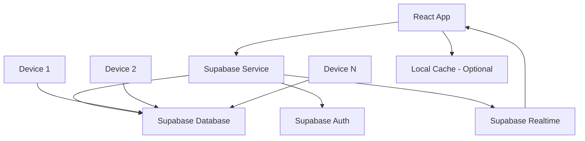

# Cloud Sync Design Document

## Overview

This design implements cloud synchronization for the journal application using Supabase as the backend service. Supabase's built-in features handle most of the complexity automatically: real-time synchronization, authentication, offline support, and conflict resolution. This greatly simplifies the implementation compared to custom solutions.

## Architecture

### Simplified Architecture (Leveraging Supabase)



### Simplified Data Flow (Leveraging Supabase)

1. **Write Operations**: User actions → Supabase Database (with local optimistic updates)
2. **Read Operations**: Supabase Database → React Components (with local caching)
3. **Real-time Updates**: Supabase Real-time → React State Updates (automatic)
4. **Offline Operations**: Supabase JS Client handles offline queuing automatically

## Components and Interfaces

### 1. Authentication Service

```typescript
interface AuthService {
  signIn(email: string, password: string): Promise<User>
  signUp(email: string, password: string): Promise<User>
  signOut(): Promise<void>
  getCurrentUser(): User | null
  onAuthStateChanged(callback: (user: User | null) => void): () => void
}
```

### 2. Supabase Service (Simplified Architecture)

Leveraging Supabase's built-in features eliminates most custom sync logic:

```typescript
interface SupabaseService {
  // Authentication
  signIn(email: string, password: string): Promise<User>
  signUp(email: string, password: string): Promise<User>
  signOut(): Promise<void>
  getCurrentUser(): User | null
  
  // Data operations (Supabase handles sync automatically)
  createJournal(journal: JournalEntry): Promise<JournalEntry>
  updateJournal(journal: JournalEntry): Promise<JournalEntry>
  deleteJournal(id: string): Promise<void>
  getJournals(): Promise<JournalEntry[]>
  
  // Real-time subscriptions
  subscribeToJournals(callback: (journals: JournalEntry[]) => void): () => void
}
```

### 3. Local Cache Service (Optional Enhancement)

Simple local caching for better performance:

```typescript
interface CacheService {
  getCachedJournals(): JournalEntry[]
  setCachedJournals(journals: JournalEntry[]): void
  clearCache(): void
}
```

## Data Models

### Simplified Journal Entry (Supabase Managed)

The existing JournalEntry interface remains mostly unchanged. Supabase handles versioning and sync metadata automatically:

```typescript
// Existing JournalEntry interface works as-is
// Supabase adds these fields automatically:
interface SupabaseJournalEntry extends JournalEntry {
  user_id: string // Added by Supabase RLS
  created_at: string // Managed by Supabase
  updated_at: string // Managed by Supabase
  version: number // For optimistic locking
}
```

### User Profile (Simplified)

```typescript
interface UserProfile {
  id: string // Supabase auth.users.id
  email: string
  created_at: string
  last_active_at: string
}
```

## Infrastructure as Code (Terraform)

### Terraform Configuration Structure

```
infrastructure/
├── main.tf                 # Main Terraform configuration
├── variables.tf           # Input variables
├── outputs.tf            # Output values
├── terraform.tfvars      # Environment-specific values
└── modules/
    └── supabase/
        ├── main.tf       # Supabase resources
        ├── variables.tf  # Module variables
        └── outputs.tf    # Module outputs
```

### Supabase Terraform Provider

```hcl
terraform {
  required_providers {
    supabase = {
      source  = "supabase/supabase"
      version = "~> 1.0"
    }
  }
}

provider "supabase" {
  access_token = var.supabase_access_token
  db_password  = var.supabase_db_password
}
```

### Infrastructure Resources

```hcl
# Supabase Project
resource "supabase_project" "journal_app" {
  organization_id   = var.supabase_org_id
  name             = "journal-flow-${var.environment}"
  database_password = var.supabase_db_password
  region           = var.supabase_region
  
  tags = {
    Environment = var.environment
    Project     = "journal-flow"
  }
}

# Database Schema
resource "supabase_schema" "journal_schema" {
  project_ref = supabase_project.journal_app.id
  name        = "public"
  
  # SQL migrations will be applied here
  sql = file("${path.module}/schema.sql")
}

# Authentication Settings
resource "supabase_settings" "auth_settings" {
  project_ref = supabase_project.journal_app.id
  
  auth = {
    enable_signup         = true
    enable_confirmations = true
    enable_recoveries    = true
  }
}
```

### Environment Management

```hcl
# Development Environment
module "supabase_dev" {
  source = "./modules/supabase"
  
  environment    = "dev"
  supabase_org_id = var.supabase_org_id
  supabase_region = "ap-northeast-1"
}

# Production Environment
module "supabase_prod" {
  source = "./modules/supabase"
  
  environment    = "prod"
  supabase_org_id = var.supabase_org_id
  supabase_region = "ap-northeast-1"
}
```

## Supabase Schema Design

### Database Tables

```sql
-- Users table (managed by Supabase Auth)
CREATE TABLE profiles (
  id UUID REFERENCES auth.users PRIMARY KEY,
  email TEXT NOT NULL,
  created_at TIMESTAMP WITH TIME ZONE DEFAULT NOW(),
  last_active_at TIMESTAMP WITH TIME ZONE DEFAULT NOW()
);

-- Journals table
CREATE TABLE journals (
  id UUID PRIMARY KEY DEFAULT gen_random_uuid(),
  user_id UUID REFERENCES auth.users NOT NULL,
  type TEXT NOT NULL,
  date TEXT NOT NULL,
  created_at TIMESTAMP WITH TIME ZONE DEFAULT NOW(),
  updated_at TIMESTAMP WITH TIME ZONE DEFAULT NOW(),
  version INTEGER DEFAULT 1,
  data JSONB NOT NULL
);

-- Sync metadata table
CREATE TABLE sync_metadata (
  user_id UUID REFERENCES auth.users PRIMARY KEY,
  device_id TEXT NOT NULL,
  last_sync_timestamp TIMESTAMP WITH TIME ZONE DEFAULT NOW(),
  sync_version INTEGER DEFAULT 1
);
```

### Row Level Security (RLS) Policies

```sql
-- Enable RLS
ALTER TABLE profiles ENABLE ROW LEVEL SECURITY;
ALTER TABLE journals ENABLE ROW LEVEL SECURITY;
ALTER TABLE sync_metadata ENABLE ROW LEVEL SECURITY;

-- Profiles policies
CREATE POLICY "Users can view own profile" ON profiles
  FOR SELECT USING (auth.uid() = id);
CREATE POLICY "Users can update own profile" ON profiles
  FOR UPDATE USING (auth.uid() = id);

-- Journals policies
CREATE POLICY "Users can view own journals" ON journals
  FOR SELECT USING (auth.uid() = user_id);
CREATE POLICY "Users can insert own journals" ON journals
  FOR INSERT WITH CHECK (auth.uid() = user_id);
CREATE POLICY "Users can update own journals" ON journals
  FOR UPDATE USING (auth.uid() = user_id);
CREATE POLICY "Users can delete own journals" ON journals
  FOR DELETE USING (auth.uid() = user_id);

-- Sync metadata policies
CREATE POLICY "Users can manage own sync metadata" ON sync_metadata
  FOR ALL USING (auth.uid() = user_id);
```

## Error Handling (Simplified with Supabase)

Supabase handles most error scenarios automatically, reducing custom error handling needs:

### Key Error Types to Handle

1. **Authentication Errors**: Invalid credentials, session expiry
2. **Network Errors**: Connection issues (Supabase client handles retries)
3. **Validation Errors**: Data format issues

### Simplified Error Handling

```typescript
interface ErrorHandler {
  handleAuthError(error: AuthError): void
  handleNetworkError(error: NetworkError): void
  handleValidationError(error: ValidationError): void
  showUserMessage(message: string, type: 'error' | 'success' | 'info'): void
}

// Supabase provides detailed error information
type SupabaseError = {
  message: string
  details: string
  hint: string
  code: string
}
```

## Testing Strategy (Simplified with Supabase)

### Unit Tests

1. **Supabase Service Tests**
   - Test CRUD operations
   - Test authentication flows
   - Test real-time subscription setup

2. **Component Tests**
   - Test UI components with auth states
   - Test data loading and error states
   - Test optimistic updates

### Integration Tests

1. **End-to-End Tests**
   - Test complete user workflows
   - Test cross-device data consistency
   - Test real-time updates between components

### Performance Tests

1. **Basic Performance**
   - Test initial data loading
   - Test real-time update responsiveness
   - Test offline/online transitions

## Implementation Phases (Simplified with Supabase)

### Phase 1: Infrastructure & Authentication
- Terraform configuration for Supabase infrastructure
- Database schema setup with RLS policies via Terraform
- Supabase project provisioning and configuration
- Authentication service implementation
- Login/signup UI components

### Phase 2: Data Integration
- Replace local-only storage with Supabase operations
- Implement CRUD operations using Supabase client
- Add optimistic updates for better UX

### Phase 3: Real-time Features
- Implement Supabase real-time subscriptions
- Add sync status indicators
- Handle real-time data updates in UI

### Phase 4: Polish & Error Handling
- Add comprehensive error handling
- Implement user feedback notifications
- Add loading states and offline indicators
- Performance optimizations and caching